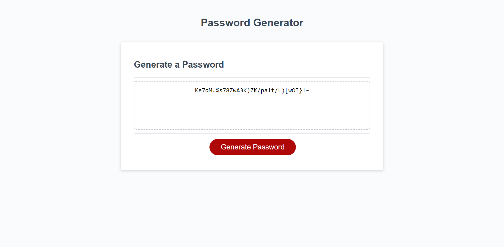

# wk3-passwordpls

## Project
this is a random password generator
It has prompts that allow you to select the amount of characters in your password, whether you want uppercase, lowercase, numbers, and or special characters in your password.

## Github link
The repository link to the project

## File links
to open [index.html](index.html) file to view the code

to open the screenshot here is the link [screenshot.png](assets/images/screenshot.png)

